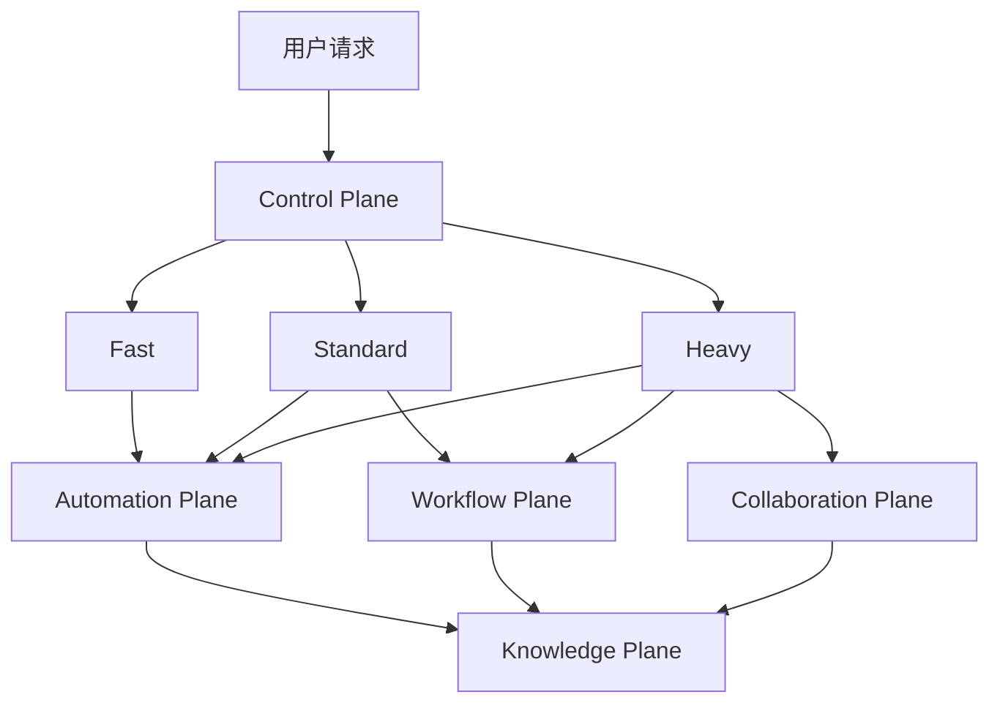

# 架构总览

## 重构目标

当前系统把 ECC、Superpowers、Agency Agents 与 Level 8 的 shared-state、sprint memory、autonomous permissions 叠加在一起，能力很强，但默认强度过高。重构后的系统要解决两个问题：

1. 保留高价值能力。
2. 把流程成本限制在真正需要它的任务上。

## 新架构：五个平面

### 1. Control Plane

负责“判断现在应该走什么流程”，是系统新核心。

职责：

- 判断任务模式：`Fast / Standard / Heavy`
- 识别风险：认证、支付、部署、迁移、删除、网络写操作
- 控制自动化强度
- 处理用户覆盖指令
- 决定是否进入单 agent / 多 agent 模式
- 管理降级策略

输入：

- 用户请求
- 当前代码变更规模
- 文件路径与目录类别
- 风险关键词
- 当前运行环境能力

输出：

- 当前任务模式
- 建议自动化动作
- 需要的手动命令
- 是否要求人工确认

### 2. Automation Plane

负责默认自动执行的 hooks，只放“快、稳、低噪音”的动作。

职责：

- 启动时加载上下文
- 编辑后做轻量检查
- 停止时写简短摘要
- 进行风险升级提醒

原则：

- 默认只运行低成本动作
- 不在每次编辑后跑全量 build / test / review
- 自动化失败时不能阻塞基础工作流

### 3. Workflow Plane

负责手动命令和人工可控的执行链。

职责：

- `/plan`
- `/tdd`
- `/verify`
- `/code-review`
- `/save-session`
- `/resume-session`

原则：

- 文档先行，命令说明必须清楚
- 只有用户明确需要或任务确实升级时，才进入更重的流程

### 4. Collaboration Plane

负责多 agent 协作，是重型能力，不允许默认全开。

职责：

- shared-state
- task claim
- file claim
- handoff
- worktree / tmux / control plane snapshot

原则：

- 仅用于 Heavy 任务
- 必须有最小并发安全
- 任一协调组件失败时，允许降级回单 agent

### 5. Knowledge Plane

负责 session memory、sprint memory、长期模式沉淀、错误教训回路。

职责：

- 记录决策
- 记录约束
- 记录未完成事项
- 记录跨会话需要延续的上下文
- **错误教训回路**：从自身错误和跨工具共享记忆中提取教训，写入 CLAUDE.md 作为团队知识库

#### 5.1 错误教训回路（Lessons Learned Loop）

CLAUDE.md 不仅是配置文件，也是**团队知识库**。所有 AI 工具（Claude Code、Codex、其他模型）的错误和经验都汇聚于此，确保任何工具在任何会话中都能避免已知陷阱。

**数据源**：

| 来源 | 路径 | 说明 |
|------|------|------|
| Claude Code 自身错误 | 会话中被用户纠正 | 用户说”不对””别这样”时触发 |
| 跨工具共享记忆 | `.memory/today.md` → `weekly.md` → `long-term.md` | Codex、OpenClaw 等工具写入的错误记录 |
| 漂移检测 | `.claude/.drift-state/` | 反复编辑、连续测试失败等行为模式 |
| Code Review 发现 | `/code-review` 输出 | CRITICAL/HIGH 级别问题的模式 |

**写入规则**：

1. **触发条件**：用户纠正、连续测试失败后修复、code review 发现重复问题
2. **写入位置**：`CLAUDE.md` 的 `## 错误教训日志` section
3. **格式**：`- [日期] 错误描述 → 正确做法`
4. **去重**：写入前检查是否已有相同教训，避免重复
5. **沉淀**：超过 20 条时，归纳为规则写入 `.claude/rules/` 下对应文件

**生命周期**：

```
错误发生 → 记录到 CLAUDE.md 错误教训日志
    ↓
多次出现同类错误 → 归纳为规则 → 写入 .claude/rules/
    ↓
规则稳定验证后 → 可选：实现为 hook 自动检查
```

**跨工具同步**：

```
Claude Code 犯错 → 写入 CLAUDE.md + .memory/today.md
Codex 犯错 → 写入 .memory/today.md
任何工具启动 → 读取 CLAUDE.md（含错误教训）+ .memory/long-term.md
```

这使得 CLAUDE.md 成为**所有 AI 工具共享的免疫系统**——一个工具犯过的错，所有工具都不会再犯。

原则：

- 记录”对未来有用”的信息
- 不记录低价值流水日志
- 不让记忆反过来污染当前任务上下文
- **错误教训必须可操作**：每条都包含”正确做法”，而非仅描述错误
- **定期归纳**：避免教训列表无限膨胀，及时提炼为规则

## 结构关系



## 默认运行原则

1. 所有任务先进入 Control Plane。
2. 能在 `Fast` 完成的任务，绝不强制升级。
3. `Standard` 只增加必要验证，不引入协作控制面。
4. `Heavy` 才启用 shared-state、sprint memory、多 agent 编排。
5. 用户明确说”直接做””不要 TDD””不要多 agent”时，Control Plane 允许降级。

### “默认轻量”的含义

“默认轻量”指**流程轻量**，不等于权限最小化：

- **流程轻量**：默认不启用 TDD 强制、shared-state、多 agent、重型 memory 链路、全量验证。小任务只跑 Always-on hooks。
- **权限宽松**：默认保持 `Bash(*)` 等全开放授权，避免人工授权打断。风险控制由 hook 守卫（careful-guard、freeze-guard、pre-tool-escalate）承担。

### 风险控制架构

当前系统的风险控制不依赖配置层最小权限，而是依赖三层运行时机制：

1. **PreToolUse 守卫**（始终活跃）：
   - `careful-guard`：阻断破坏性命令
   - `freeze-guard`：阻断锁定范围外编辑
   - `pre-tool-escalate`：检测高风险操作，自动升档模式

2. **模式门控**（按需启用）：
   - Standard+ hooks 在高风险操作时自动激活（漂移检测、质量门、风险提示）
   - Heavy hooks 在认证/支付/部署等场景激活（shared-state、严格验证）

3. **可选配置层收紧**：
   - 三层权限模型作为**治理框架**，可在高安全场景下配置 allowlist/denylist
   - 不作为当前默认运行配置

## 建议目录结构

```text
CLAUDE.md
.claude/
  settings.json
  settings.local.example.json
  rules/
    routing.md
    automation-policy.md
    permission-policy.md
    memory-policy.md
  commands/
    plan.md
    tdd.md
    verify.md
    code-review.md
    save-session.md
    resume-session.md
  scripts/
    hooks/
      session-start.js
      task-router.js
      post-edit-light.js
      stop-summary.js
      risk-escalation.js
      shared-state-sync.js
      sprint-memory.js
  shared-state/
    README.md
    schema.json
    handoff-template.md
  memory/
    README.md
docs/
  architecture.md
  routing.md
  automation.md
  manual-commands.md
  permissions.md
  shared-state.md
  recovery.md
```
